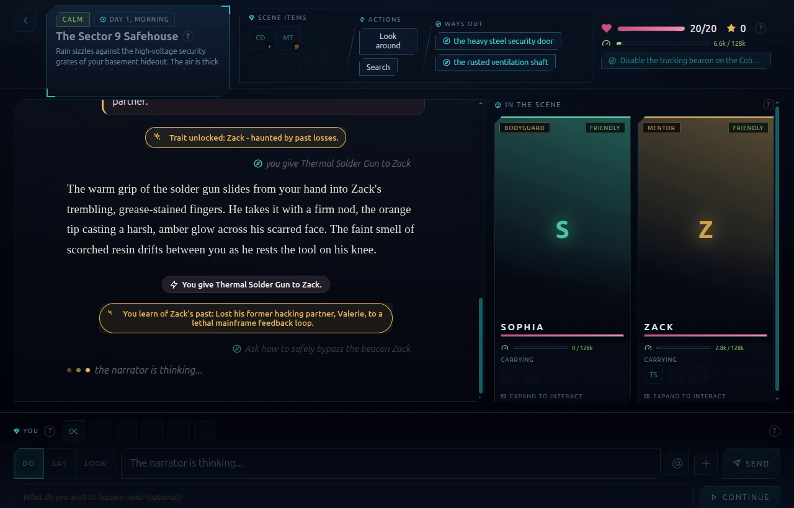
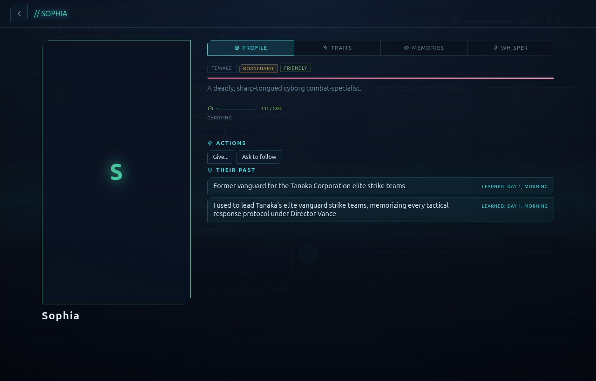

# 🎲 Gamentic on Anna

> ⚠️ **The 65s invoke cap (read this first).** Anna's dev runtime caps every tool call at ~65 seconds and restarts the executa if one runs longer. A single image render takes 35-90s, which blows that window, so **image generation ships disabled** (`IMAGE_ENABLED=false`): with it on, creating or re-entering an adventure can time out and crash the executa. Everything else (narration, dialogue, characters, whispers, inventory, scene changes, quests) runs comfortably under the cap and is stable. Flip `IMAGE_ENABLED=true` once Anna raises the per-invoke cap.

Describe a world in one sentence, then **play it** turn by turn: a live narrator, characters you talk and whisper to, an inventory you loot and gift, scene changes, new characters on the fly, and quests. It runs **natively as an Anna App**, with no GPU, no third-party bridge, and no bundled model: the engine reverse-RPCs Anna's own host for every token.

## 📸 Screenshots

<p align="center">
  
  
</p>

<p align="center"><em>A turn in play (scene, narration, party) and a character's profile + whisper channel.</em></p>

## 🎮 Play it on Anna

> 🧩 **Before anything else:** install the **Anna local Agent** and keep it running ([download it here](https://anna.partners/download)). The game engine runs on your Agent. The browser has no runtime of its own.

Then three steps, in order:

#### 📦 1. Install the app
Open **More**, go to the **App Store**, find **gamentic-anna**, and hit **Install**.

#### 🔑 2. Let it use the model
Open **More**, then **Advanced**, then **Executas**, then **Learned**. Pick **Gamentic**, open its **Permissions**, and switch **LLM Sampling** on.

#### 🚀 3. Bring the engine online
Open **More**, then **Agents**. On your Agent, click **Install Essentials**. Open **Details** and wait until **Gamentic** reads **Running**.

> 💡 **Don't skip step 2.** LLM Sampling is what lets the engine reach the model on every turn. Without it you only get placeholder text instead of real AI.

🎲 That's it. Open the app and play.

<sub>Under the hood: Install Essentials runs `uv tool install tool-gamentic-engine-7h8aweky` from PyPI, no per-platform binary. A single `py3-none-any` wheel covers macOS, Linux and Windows (verified end to end on Linux so far).</sub>

## 🏆 Hackathon submission

Anna AI-Native App Hackathon. A working app running on Anna today: an Anna **App** plus an **Executa**.

| | |
|---|---|
| **What** | A complete AI dungeon master: describe a world, then play a text RPG with a narrator and characters that remember you. |
| **Who it's for** | Anyone on Anna who wants a rich, replayable AI RPG (one sentence in, a world out). For builders: a clean pattern for running a full FastAPI app natively on Anna. |
| **How AI is used** | The narrator, every character (each its own agent with private memory), the world-creator, and the free-text interpreter are all Anna-host LLM calls. Image generation is wired the same way (Anna's `image/generate`) but disabled by default, see the cap note above. |
| **How it connects to Anna** | The UI is an Anna iframe; the engine is an Executa it calls over `anna.tools.invoke`. The Executa reverse-RPCs the host for `sampling/createMessage` (text) and `image/generate` (images). Anna owns the model, billing and quota. |

## ✨ What works (live, inside the Anna iframe)

| Area | Capability |
|---|---|
| 🌍 **Create** | A whole adventure from one sentence (world, cast, scene, items, exits, quests). |
| 📖 **Play** | Narration + dialogue per turn; freeform typing is interpreted into directed actions. |
| 🗣️ **Talk** | Per-character chat and private **whispers** (1:1, never shown to anyone else). |
| 🎒 **Inventory** | Take items from a scene, give items to characters; deterministic, model-independent. |
| 🚪 **World** | Scene transitions, new characters spawned on the fly, exits revealed as you explore. |
| 🧠 **Memory** | Each character keeps a private rolling memory; the story keeps a recap, so context stays bounded. |
| 🖼️ **Art** *(wired, off by default)* | Scene images, portraits and item cards via Anna's image host. Off because one render exceeds the 65s invoke cap (above); set `IMAGE_ENABLED=true` to try. |

**Why it's robust:** the core mechanics (movement, take, give, dialogue cueing, world seeding) are **deterministic engine-side**, so gameplay holds up even on models that won't reliably emit tool calls. The model writes the prose and dialogue; the rules (what's possible, what each action does) are enforced in code.

### What's trimmed on Anna (and why)

To keep every turn inside the 65s invoke cap and avoid dead affordances, the Anna build hides a few things the engine still supports:

| Trimmed | Why |
|---|---|
| 🔍 **Look / Search** | A look turn's only real payoff was the scene render, and images ship off. Disabled in the composer, the scene action bar and the character panel. |
| 🔊 **Voice / speaker icon** | Anna has no host TTS, so the per-line speak button would never play. Hidden in Anna mode. |
| 🖼️ **Image area** | With no portrait to fill it, the tall character card collapses to a compact plate instead of a big empty box. |
| 🎁 **Give** | Handing an item to a character now closes the popups and drops you back on the main screen, rather than opening their whisper thread. |

Resume is resilient to the harness recycling the executa: idempotent reads (state, beats, library) retry a few times before surfacing an error, so re-opening an adventure no longer bounces you to the menu when the executa cycles mid-open.

## 🏗️ Architecture (one glance)

```
┌─────────────────────────────────────────────┐
│  Anna copilot                               │
│  browser UI, renders the sandboxed iframe   │
└──────────────────────┬──────────────────────┘
                       │  anna.tools.invoke
                       ▼
┌─────────────────────────────────────────────┐
│  Executa  (stdio JSON-RPC)                  │
│  runs the FastAPI engine in-process (ASGI)  │
└──────────────────────┬──────────────────────┘
                       │  reverse-RPC: sampling + image
                       ▼
┌─────────────────────────────────────────────┐
│  Anna host                                  │
│  your selected model: tokens and images     │
└─────────────────────────────────────────────┘
```

Top to bottom is the call path: the iframe UI invokes the Executa, which runs the engine in-process, which reverse-RPCs the Anna host for every token (and image). One container; the original Gamentic engine and UI are kept intact, only the comms layers swap to Anna's own.

- **Backend** (`backend/app/executa.py`): the FastAPI engine wrapped as a stdio Executa. Each invoke replays an HTTP-style call against the in-process app (httpx ASGI transport), so every route, its validation and its behavior are exactly what uvicorn serves.
- **Reverse-RPC** (`backend/app/hostbridge.py`): for text and images the engine calls the Anna host directly (`sampling/createMessage`, `image/generate`) via the vendored `executa_sdk`, with bounded retries on transient gateway errors.
- **Non-blocking jobs** (`backend/app/main.py`): renders, summary folds and origin enrichment run on a detached pool, never on the request thread, so a slow job can't trip the 65s invoke cap; the frontend polls `/state` to pick up results.
- **Tool calls** (`backend/app/llm.py`): Anna sampling has no OpenAI-style function calling but does structured JSON, so the engine asks for a `{prose, tool_calls}` envelope and parses it back with a tolerant local repair (no network round-trip).
- **Frontend** (`frontend/src/app/anna.js`): the UI runs in Anna's sandboxed iframe and routes through the injected transport; standalone dev falls back to `fetch`.
- **Storage**: embedded SQLite on a Docker volume. Voice is off (Anna has no TTS).

## 📦 Run it locally (dev harness)

One container runs `anna-app dev` (Anna's own dev runtime): it serves the iframe and spawns the Executa.

```sh
docker compose up -d --build
docker exec -it gamentic-anna anna-app login --host https://anna.partners --no-browser   # device-code, once
```

Then open **http://localhost:5180** and play. Full teardown (login + saved games): `docker compose down -v`.

> 🔑 **Pick a model.** Anna serves whatever model your account selects (LLM / Model Selection). Self-hosted models see more gateway (502) hiccups and ship smaller context; a Pro-tier (OpenRouter-backed) model gives steadier responses and far more context.

## 🗂️ Layout

```
backend/
  app/executa.py     the Anna Executa: stdio JSON-RPC + reverse-RPC to the host
  app/hostbridge.py  the sync engine -> host bridge (sampling, image)
  app/main.py        the FastAPI engine + the detached post-response job pool
  app/llm.py         chat(): native sampling + the {prose, tool_calls} envelope
  executa.json       executa descriptor (tool_id, command, host_capabilities)
  executa_sdk/       vendored Anna executa SDK (SamplingClient, ImageClient, ...)
frontend/            Gamentic UI; src/api.js + src/app/anna.js carry the Anna transport
infra/Dockerfile     the single image: node + anna-app + the engine venv
manifest.json        the Anna App manifest (iframe view, required executa, host-API grants)
docker-compose.yml
```

## 🧪 Tests

**572 backend + 237 frontend tests pass.**

```sh
# frontend (vitest + Testing Library, msw, jsdom)
cd frontend && npm install && npm test

# backend (pytest, end-to-end through the real engine + the real Executa stdio/reverse-RPC,
# with host sampling faked only at the boundary)
cd backend && uv venv && uv pip install -e . pytest && .venv/bin/python -m pytest
```

`tests/test_executa_native.py` drives a full adventure (create world, scene change, scene item, pickup, give to a character, a character arriving, a whisper) through the live Executa protocol.

## 📝 Notes

- **The 65s invoke cap is the headline constraint.** It bounds image generation (off by default) and is why post-response jobs run detached. Watch for it if you re-enable images or add slow per-turn work.
- **Token budget:** Anna's executa-side sampling makes `max_tokens` mandatory and caps it at 8192; the engine always passes the maximum and shapes length through the prompt, never a truncating ceiling.
- **Images (when enabled):** generated images come back as short-lived host URLs; the engine persists each per game, then the Executa inlines it to the iframe as a data URI (the sandboxed iframe cannot fetch arbitrary URLs).
- **Publishing:** the Executa is published to Anna's Executa Hub and referenced by `tool_id`; on Install Essentials the user's Agent runs `uv tool install <package>==<version>` from **PyPI** (`backend/pyproject.toml` builds the wheel; one `py3-none-any` artifact plus uv-resolved dependency wheels cover every platform). A wheel URL does not work here because the Agent always appends `==<version>`, which only a package name (not a URL) resolves. This repo is the dev/run setup for that app.
